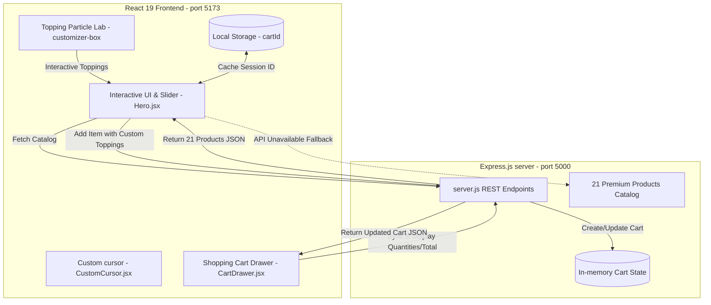

# 🧁 DvBakes — Full-Stack Interactive 3D Bakery Slider & Lab

[](https://react.dev)
[](https://vite.dev)
[](https://expressjs.com)
[](https://www.framer.com/motion/)
[]()
[]()

An immersive, premium full-stack web application showcasing a custom-styled 3D tilted product portal, a physics-based interactive Bakery Lab toppings customizer, and a glassmorphic state-synchronized shopping cart. Powered by **React 19**, **Vite**, **Framer Motion**, and **Express.js**.

> [!NOTE]
> This application implements a resilient fallback mechanism. If the backend Express server is offline, the client automatically defaults to its local database (`FALLBACK_SLIDES`) to guarantee continuous uptime and visual fidelity.

---

## 🗺️ System & State Architecture

The application employs a decoupled client-server architecture where stateful cart interactions and product details are governed by an Express.js backend. State updates are broadcast back to the React client and stored locally for continuous session tracking.



---

## ✨ Key Highlights & Features

### 1. 3D Parallax Display Portal
*   **Tilt Physics**: Features a mouse-parallax-guided frame container using Framer Motion springs (`stiffness: 100`, `damping: 22`).
*   **Depth Separation**: Uses absolute Z-axis offsets (`translateZ(60px)`) to visually separate product shadow, main product image, background typography, and falling particles.
*   **Multiply Blend Filters**: Dynamic CSS blend modes (`mixBlendMode: multiply`) are automatically applied to clean background borders on gourmet pastries.

### 2. Interactive Toppings Lab
*   **Physics Simulator**: Users can toggle custom toppings (Sprinkles, Chocolate Chips, Mint Leaves, Marshmallows). Toggling spawns 25 active particle streams that slide downwards with randomized delays, speeds, and initial angles.
*   **5-Second Particle Decay**: Designed to prevent UI clutter, particles automatically decay and toppings auto-untoggle after a 5-second window, preserving graphics performance.
*   **Autoplay Lock**: Slider transitions are paused dynamically while custom toppings are active or when the shopping cart drawer is open.

### 3. Dynamic Interactive Details Card
*   **Tab-Switching Matrix**: View detailed specs, ingredients list, and nutrition charts seamlessly.
*   **Dynamic Animation Fills**: Nutrition values trigger animated CSS progress bars matching the active product's primary theme color.
*   **Theme Synchronization**: The active product's unique visual configuration dictates the application-wide color styling (background gradient, text colors, button states, and active tags).

### 4. Stateful Glassmorphic Shopping Cart Drawer
*   **State-Synchronized CRUD**: Performs real-time API integrations with the backend to add products, adjust quantities, toggle add-on settings, and remove items.
*   **Order Calculations**: Automatically manages tax estimations (8%), shipping status ($2.99 standard, and a free shipping incentive warning for totals under $20.00).
*   **Checkout Simulations**: Provides a processing checkout UI accompanied by an order success screen and localized state purging.

### 5. Dynamic Custom Cursor
*   **Aesthetic Feedback**: Custom mouse tracker built with Framer Motion spring values.
*   **Interactive Labeling**: Attaches to DOM nodes via a `MutationObserver` to render dynamic action badges (`SLIDE`, `SELECT`, `ADD`, `ORDER`) when hovering over buttons, tabs, toggles, or deck elements.

---

## 🛠️ Tech Stack & Dependencies

### Frontend (`/vite-project`)
*   **Core**: React 19 (React-DOM)
*   **Bundler & Dev Server**: Vite 7
*   **Animations**: Framer Motion 12
*   **Icons**: React Icons (Fi & Fa libraries)
*   **Styling**: Pure Vanilla CSS

### Backend (`/backend`)
*   **Platform**: Node.js
*   **Framework**: Express.js
*   **Middleware**: CORS, `express.json()` parser
*   **Database**: Stateful in-memory collection (keyed by client UUIDs)

---

## 📡 Backend REST API Specification

All backend routes are hosted by default on `http://localhost:5000` and are automatically proxied via the Vite server configs.

| Method | Endpoint | Request Body | Description |
| :--- | :--- | :--- | :--- |
| **GET** | `/api/products` | *None* | Retrieves the full catalog of 21 premium bakery items. |
| **GET** | `/api/cart` | `query: cartId` *(Optional)* | Returns items currently in the cart. Spawns a new `cartId` if omitted. |
| **POST** | `/api/cart` | `cartId`, `productId`, `quantity`, `toppings` | Adds a product to the cart with toppings. Combines duplicate configuration keys. |
| **PUT** | `/api/cart/item` | `cartId`, `itemId`, `quantity`, `toppings` *(Optional)* | Updates quantity or toppings. Deletes item if quantity is set to `0`. |
| **DELETE** | `/api/cart/item` | `cartId`, `itemId` | Removes the specified item from the client cart. |
| **POST** | `/api/cart/clear` | `cartId` | Clears all cart items during checkout. |

### Payload Schema Examples

#### Add / Update Cart Item (`POST /api/cart`)
```json
{
  "cartId": "xyz123abc",
  "productId": "mint-cupcake",
  "quantity": 2,
  "toppings": {
    "sprinkles": true,
    "chocoChips": false,
    "mintLeaves": true,
    "marshmallows": false
  }
}
```

#### Response Cart Schema
```json
{
  "cartId": "xyz123abc",
  "items": [
    {
      "id": "item-uuid-456",
      "productId": "mint-cupcake",
      "name": "Minty Cupcake Cloud",
      "price": 4.50,
      "src": "./images/cupcake.png",
      "quantity": 2,
      "toppings": {
        "sprinkles": true,
        "chocoChips": false,
        "mintLeaves": true,
        "marshmallows": false
      },
      "toppingsKey": "mintLeaves,sprinkles"
    }
  ]
}
```

---

## 📂 Project Directory Structure

```text
bakery-slider/
├── backend/                       # Express API Server
│   ├── server.js                  # Main server, routing, and product database
│   ├── package.json               # Server dependencies & launch scripts
│   └── package-lock.json
├── vite-project/                  # React Client Application
│   ├── public/                    # Static resources & images
│   │   ├── images/                # Product PNG renders (transparent alpha)
│   │   └── vite.svg
│   ├── src/                       # Application source
│   │   ├── assets/
│   │   ├── components/            # React UI components & stylesheets
│   │   │   ├── CartDrawer.css     # Glassmorphic cart styling
│   │   │   ├── CartDrawer.jsx     # Cart item lists, totals, checkout flow
│   │   │   ├── CustomCursor.css   # Custom cursor canvas/circles styling
│   │   │   ├── CustomCursor.jsx   # Cursor spring tracking & observer listeners
│   │   │   ├── Hero.css           # Grid system, 3D cards, and particle layers
│   │   │   ├── Hero.jsx           # Main slider controller, physics and API integrations
│   │   │   ├── HeroSlide.css
│   │   │   ├── HeroSlide.jsx
│   │   │   ├── Navbar.css         # Glassmorphic header styles
│   │   │   └── Navbar.jsx         # Nav layouts, count indicator, and responsive drawer
│   │   ├── App.css
│   │   ├── App.jsx
│   │   ├── index.css              # Global styling variables & design tokens
│   │   └── main.jsx
│   ├── vite.config.js             # Client bundler and server proxy configs
│   ├── package.json               # Client packages & scripts
│   └── eslint.config.js
└── README.md                      # Project documentation
```

---

## 🚀 Getting Started & Local Setup

To set up DvBakes on your machine, follow these instructions.

### Prerequisites
*   Ensure **Node.js** (v18.0.0 or higher) is installed.

### 1. Installation
Clone the repository and install packages in both workspaces:
```bash
# Clone the repository
git clone https://github.com/kriss2012/bakery-slider.git
cd bakery-slider

# Install dependencies for both project folders
cd vite-project
npm install

cd ../backend
npm install
```

### 2. Launching the Application
You will need to open two separate terminal sessions to start the backend and frontend dev servers:

#### Start the Express Server (API)
```bash
cd backend
npm run dev
```
> [!TIP]
> The backend server launches at `http://localhost:5000`. You should see `Bakery Backend API running on http://localhost:5000` output in your console.

#### Start the React App (Vite Dev Server)
```bash
cd vite-project
npm run dev
```
> [!TIP]
> The frontend launches at `http://localhost:5173`. Open this URL in your web browser.

---

## 🔗 Key Codebase Reference Points

For developers looking to inspect or modify the core functionality, refer to the following local links:

*   **API routes, endpoints, and database models**: [backend/server.js](file:///d:/Web-Projects/bakery-slider/backend/server.js) contains the Express server configurations and the 21 premium products database list.
*   **3D Parallax, particle generator, and main slider loop**: [vite-project/src/components/Hero.jsx](file:///d:/Web-Projects/bakery-slider/vite-project/src/components/Hero.jsx) manages the mouse parallax spring formulas and active states.
*   **Cart drawer calculations & slide animation**: [vite-project/src/components/CartDrawer.jsx](file:///d:/Web-Projects/bakery-slider/vite-project/src/components/CartDrawer.jsx) implements the shopping cart logic and totals calculations.
*   **Reactive custom cursor implementation**: [vite-project/src/components/CustomCursor.jsx](file:///d:/Web-Projects/bakery-slider/vite-project/src/components/CustomCursor.jsx) manages mouse positions, spring bindings, and dynamic element hover states.
*   **Global variables and styling system**: [vite-project/src/index.css](file:///d:/Web-Projects/bakery-slider/vite-project/src/index.css) defines the color tokens, fonts, and responsive layout foundations.
